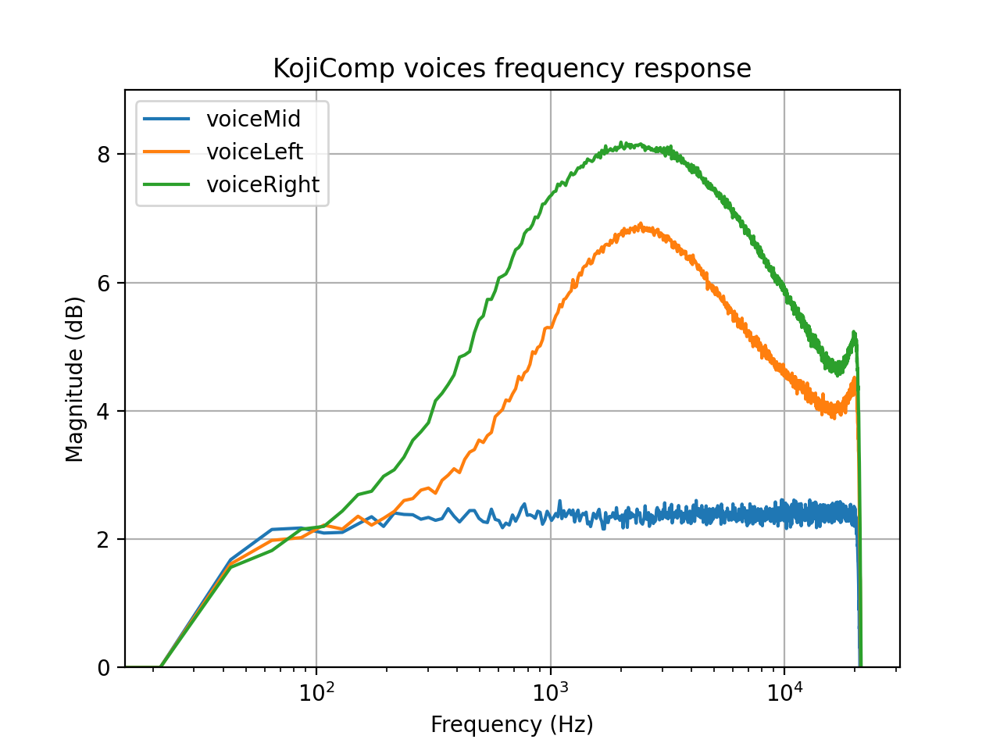

# PunkComp - A compressor pedal plugin

## Introduction
This is a simple vst3/au audio compressor plugin made with <a href="https://juce.com/" target="_blank">JUCE</a> that I build to introduce myself in the JUCE framework. The functionality is inspired by the Koji Comp by Suhr, although the compression behaviour is not the same (yet). The project was mostly used to further my understanding and knowledge of digital signal processing and digital audio effects.

## Features
- Input Gain (from -18 up to 18 dB).
- Output Gain (from -18 up to 18 dB).
- Compressor: It adjust simultaneously the input gain (from -5dB up to 20dB) and the threshold (from -5 down to -25dB).
- Attack time (from 1 up to 100ms).
- Fixed release time of 50ms.
- Fixed ratio of 4:1.
- Gain reduction metering.
- Mix between dry and wet signal.
- Voice switch: The voice switch acts as an equalizer after the compression (notice that it's not affected by the mix knob). Here is a description of each voice according to Suhr's own words:
    - Left: Offers a boost to the upper midrange frequencies to bring out the attack in your picking.
    - Middle: Transparent (flat) frequency response.
    - Right: Offers a boost in the upper midrange and treble frequencies – for a smooth, glassy, top-end sweetness.
    - Here is a graph showing some home measures that I did with which I've imitated the different voices.
    

## TODO
- Migrate project to CMake.
- The compressor implementation uses the JUCE built-in Compressor class. I want to program my own Compressor class to better imitate the behaviour of the Koji Comp.
